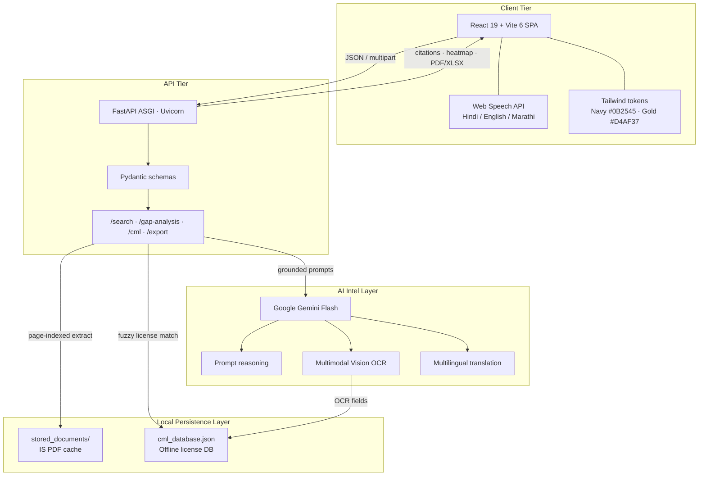
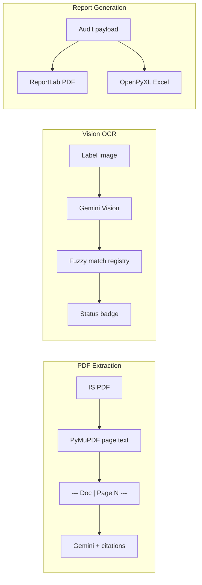

# PROJECT ARCHITECTURE

**ManakSetu — BIS Compliance & Analytics Portal**

This document specifies the four-tier architecture, processing pipelines, and resilience model of the portal. It is intended for engineers extending search, vision OCR, gap analysis, or export.

---

## 1. System Architecture Overview

ManakSetu is a four-tier system: a React SPA talks to an async FastAPI engine; the engine reasons over a local IS PDF cache and CM/L registry, calling Google Gemini Flash only for language, vision, and structured scoring.

```text
┌─────────────────────────────────────────────────────────────────┐
│                        CLIENT TIER                              │
│  React 19 + Vite 6 SPA  ·  Tailwind Navy/Gold  ·  Web Speech    │
└──────────────────────────────┬──────────────────────────────────┘
                               │ HTTPS / JSON / multipart
┌──────────────────────────────▼──────────────────────────────────┐
│                         API TIER                                │
│  FastAPI ASGI  ·  Pydantic schemas  ·  /search /gap-analysis    │
│  /cml  /export  ·  CORS  ·  Uvicorn                             │
└──────────────┬───────────────────────────────┬──────────────────┘
               │                               │
┌──────────────▼──────────────┐  ┌─────────────▼─────────────────┐
│      AI INTEL LAYER         │  │   LOCAL PERSISTENCE LAYER     │
│  Google Gemini Flash        │  │  stored_documents/  (IS PDFs) │
│  Prompt reasoning           │  │  cml_database.json  (licenses)│
│  Multimodal vision OCR      │  │  temp_uploads/      (scratch) │
│  Multilingual translation   │  └───────────────────────────────┘
└─────────────────────────────┘
```

### 1.1 Client Tier

| Concern | Implementation |
| --- | --- |
| Runtime | React 19 SPA bundled by Vite 6 |
| Styling | Tailwind CSS v4 `@theme` tokens: Navy `#0B2545`, Gold `#D4AF37`, surfaces `#071527` / `#13315C` |
| Speech | Web Speech API — `SpeechRecognition` (Hindi `hi-IN`, English `en-IN`, Marathi `mr-IN`) and `speechSynthesis` TTS |
| HTTP | Axios client (`frontend/src/services/api.js`) targeting `http://localhost:8000/api` |
| Visualization | Recharts analytics; interactive PDF viewer for citation jump-to-page |

Tabs: Standards search, Gap Analysis, Summary, Penalties, CM/L Scanner, Analytics.

### 1.2 API Tier

FastAPI ASGI app in `backend/app/main.py` (Uvicorn, reload in development).

- **Pydantic** request bodies: `SearchRequest`, `PreloadSearchRequest`, `GapAnalysisRequest`, `ExportPayload`, etc.
- **python-multipart** for PDF and image uploads.
- **CORS:** `allow_origins=["*"]`, credentials, all methods and headers (tighten for production).

Primary endpoint families:

| Family | Routes | Role |
| --- | --- | --- |
| Search | `POST /api/search`, `/api/search/preloaded`, `/api/search/custom` | Clause-cited Q&A over indexed PDFs |
| Gap | `POST /api/gap-analysis` | Spec vs standard PASS/WARNING/FAIL |
| CML | `POST /api/cml-verify`, `POST /api/cml/verify-enhanced`, `GET /api/cml/registry` | Vision + registry |
| Export | `POST /api/export/pdf`, `POST /api/export/excel` | Binary report download |
| Docs | `GET /api/documents`, `POST /api/upload` | Local PDF cache CRUD |
| Intel | `POST /api/summary`, `POST /api/penalties`, `GET /api/analytics/metrics` | Digest, liability, KPIs |

### 1.3 AI Intel Layer

`backend/app/core/ai_engine.py` wraps `google.genai`.

| Capability | Mechanism |
| --- | --- |
| Prompt reasoning | `generate_ai_response(prompt)` for search, gap JSON, summary, penalties |
| Multimodal vision OCR | `generate_ai_vision_response(prompt, image_bytes, mime_type)` with `types.Part.from_bytes` |
| Multilingual | Language instructions (English / Hindi / Marathi, plus Gujarati, Bengali, Tamil on the API) injected into every prompt |
| Resilience | Primary `GEMINI_MODEL` then Flash fallbacks on 404 / 429 / 503 / 500 |

The API key is loaded from `backend/.env` (`GEMINI_API_KEY`) and never sent to the browser.

### 1.4 Local Persistence Layer

| Store | Path | Purpose |
| --- | --- | --- |
| IS PDF cache | `backend/stored_documents/` | Official standards used for search, gap analysis, citations, analytics |
| CM/L registry | `backend/cml_database.json` | Offline license records: number, manufacturer, standard, validity, status |
| Scratch | `backend/temp_uploads/` | Custom-search uploads that should not pollute the official cache |

No remote government API is required at request time. Local files are the source of truth for availability.

---

## 2. Data Flow & Processing Pipelines

### 2.1 PDF Extraction Pipeline (zero-hallucination citations)

Goal: every model citation can be traced to a real page.

```text
stored_documents/*.pdf
        │
        ▼
  PyMuPDF (fitz.open)
        │  for each page:
        │    page.get_text("text")
        │    prefix: "--- Doc: {filename} | Page {n} ---"
        ▼
  combined_text  (capped ~500K chars)
        │
        ▼
  Gemini Flash  (must emit [Doc: <file.pdf> | Page <N>])
        │
        ▼
  SPA ResultCard + InteractivePdfViewer  (jump to page N)
```

Implementation: `pdf_service.extract_text_from_all_pdfs()`. Preloaded search (`routes_preload_search.py`) instructs the model to use the exact citation syntax `[Doc: <Document_Name.pdf> | Page <Page_Number>]`. Voice mode suppresses markdown tables so TTS remains speakable.

### 2.2 Vision OCR Pipeline (CM/L authenticity)

```text
Label image (JPEG / PNG / WebP)
        │  POST /api/cml/verify-enhanced
        ▼
  Gemini Vision  (vision_service.analyze_cml_image)
        │  extracts JSON: cml_number, manufacturer, standard, is_valid
        ▼
  Fuzzy match vs cml_database.json
        │  digit-stripped license compare
        │  manufacturer substring fallback
        ▼
  Status badge: VALID | EXPIRED | SUSPENDED | UNREGISTERED | NOT_FOUND_IN_REGISTRY
```

Composite authenticity is `db_matched && status == VALID`. Registry listing remains available via `GET /api/cml/registry` with no Gemini call.

### 2.3 Report Generation Pipeline

```text
UI payload { title, content, doc_names }
        │
        ├── POST /api/export/pdf
        │         ▼
        │   ReportLab SimpleDocTemplate + NumberedCanvas
        │   Navy/Gold header, page X of Y footer, structured sections
        │         ▼
        │   application/pdf  →  BIS_Compliance_Report.pdf
        │
        └── POST /api/export/excel
                  ▼
            pandas DataFrame → OpenPyXL engine
            sheets: Audit Summary + Compliance Checklist
                  ▼
            .xlsx download
```

Implementation: `export_service.generate_compliance_pdf` / `generate_compliance_excel`. Numbered footers and export timestamps support audit trail / tamper-evident presentation.

### 2.4 Gap Analysis Pipeline

1. User (or preset template) submits technical specs.
2. All (or hinted) IS PDFs are extracted with page markers.
3. Gemini returns **only** JSON: `overall_status`, `compliance_score`, per-parameter PASS/WARNING/FAIL.
4. Frontend heatmap / progress bars render the score and critical failure counts.

---

## 3. Resilience & Security Architecture

### 3.1 Local fallback (availability)

| Failure mode | Fallback |
| --- | --- |
| Official BIS / government portal down | Entire product operates on `stored_documents/` + `cml_database.json` |
| Gemini 404 / 429 / 503 / 500 | `ai_engine` walks Flash fallback model list |
| Empty CM/L registry file | Vision still returns OCR findings; status `NOT_FOUND_IN_REGISTRY` |
| Frontend cannot reach API | Document list fetch fails softly (“backend booting”) |

Search, analytics page counts, document listing, and registry browse do not depend on live government HTTP.

### 3.2 CORS

Configured in `app/main.py`:

- `allow_origins=["*"]` for local Vite (`localhost:5173`)
- `allow_credentials=True`
- all methods and headers

Production hardening: replace `*` with the deployed SPA origin.

### 3.3 Input validation (Pydantic)

- JSON bodies validated by Pydantic `BaseModel` (required `query` / `specs` / `title`+`content`).
- Empty specs rejected with HTTP 400.
- CM/L uploads restricted to `image/jpeg`, `image/png`, `image/webp`.
- Missing PDF cache returns 400 with a clear “no standards loaded” message.
- Global exception handler maps uncaught errors to JSON `{"detail": "..."}` with HTTP 500.

### 3.4 Safe API key management

- `GEMINI_API_KEY` lives only in `backend/.env` (gitignored).
- Loaded via `python-dotenv` in `app/core/config.py`.
- Gemini client is constructed server-side; the SPA never receives the key.
- Ship `backend/.env.example` with placeholders only.

---

## 4. Four-Tier Interaction Diagrams

### 4.1 ASCII — request lifecycle

```text
 Inspector / Auditor
         │
         │  type, mic (Web Speech), or camera upload
         ▼
 ┌─────────────────── CLIENT TIER ───────────────────┐
 │  React 19 + Vite 6                                 │
 │  Tailwind Navy #0B2545 / Gold #D4AF37              │
 │  LanguageContext  ·  ResultCard  ·  CMLScanner     │
 └───────────────────────┬────────────────────────────┘
                         │  Axios JSON / multipart
                         ▼
 ┌─────────────────── API TIER ───────────────────────┐
 │  FastAPI (Uvicorn ASGI)                             │
 │  Pydantic validate → route handler                  │
 │  /search  /gap-analysis  /cml  /export              │
 └───────────┬───────────────────────────┬────────────┘
             │                           │
             ▼                           ▼
 ┌─────────────────────┐     ┌────────────────────────┐
 │  AI INTEL LAYER     │     │  LOCAL PERSISTENCE     │
 │  Gemini Flash       │◄───►│  stored_documents/     │
 │  text + vision      │     │  cml_database.json     │
 │  multilingual out   │     │  (always-on cache)     │
 └─────────────────────┘     └────────────────────────┘
             │
             ▼
      JSON / PDF / XLSX  →  Client heatmap, citations, badges
```

### 4.2 Mermaid — 4-tier system



### 4.3 Mermaid — pipelines



---

## 5. Component Map (code)

| Tier | Module | Responsibility |
| --- | --- | --- |
| Client | `frontend/src/App.jsx` | Tab shell, document selection |
| Client | `frontend/src/services/api.js` | REST client |
| Client | `frontend/src/utils/speech.js` | STT / TTS |
| API | `backend/app/main.py` | App factory, CORS, routers |
| API | `backend/app/api/routes_*.py` | Endpoint handlers |
| AI | `backend/app/core/ai_engine.py` | Gemini client + fallbacks |
| Local | `backend/app/services/pdf_service.py` | Page-indexed extraction |
| Local | `backend/app/api/routes_cml_vision.py` | Registry fuzzy match |
| Reports | `backend/app/services/export_service.py` | PDF + Excel binaries |

This architecture keeps **grounding data local** and **language/vision intelligence remote**, so compliance answers stay citeable while the portal remains available when official sites are down.
